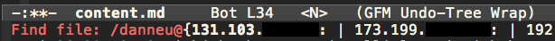

{:title "Editing Clojure remotely with Emacs + Tramp + nREPL"
 :slug "editing-clojure-remotely-with-emacs-tramp-nrepl"}
 
(Disclaimer: I'm a sysadmin/security noob)
 
It's often nice to edit code directly on my remote server.

My Clojure development workflow involves Emacs and nREPL (the headless Clojure REPL) to evaluate my code within the source files as I write them. Being able to evaluate source files line-by-line is one of the reasons I have such a productive workflow with Clojure. 

I recently discovered Emacs' [Tramp-mode](http://www.emacswiki.org/emacs/TrampMode) (comes with Emacs) which lets me open, edit, and save remote files without sacrificing any part of my local development workflow.

And by connecting my local Emacs to a remote nREPL session, the remote code that I evaluate within the buffer is executed remotely.

Some example use-cases:

- Running code against the remote database from the context of your remote app.
- Rapidly developing an app that needs to respond to remote API callbacks.
- Consolidating your development/staging/production stack into just a production stack. #cutthefat #yolo

## The Steps

Let's pretend we're editing our remote blog at `~/blogjure/src/blogjure/handler.clj`.

### 1. Start a headless nREPL session on the remote server:

```shell
remote$ cd ~/blogjure
remote$ lein repl :headless :port 50505
```

(Start nREPL within the Clojure project you want to work with so that it loads your project files.)

### 2. Forward a local port to the remote nREPL port:

(Run this is another terminal)

```shell
local$ ssh myuser@my.host.address -N -L 50505:localhost:50505
```

- `-N` means we're not executing a remote command.
- `-L` is of form `localport:host:hostport`

The host is `localhost` because it's in the context of the remote machine.

So, port 50505 on our local machine is now forwarded to localhost:50505 on our remote machine which is where our nREPL is running.

### 3. In Emacs, open up a remote file:

```text
C-x C-f //myuser@my.host.address:blogjure/src/blogjure/handler.clj
```

Hosts are autocompleted from your local **.ssh/known_hosts** and **.ssh/config**.



If you don't specify a file (or if you specify a directory):

```text
C-x C-f //myuser@my.host.address:
```

...then you'll be dropped into `dired` mode so that you can navigate to where you need to be.
    
### 4. Connect Emacs to your remote nREPL session:

```text
M-x nrepl
```

- **Host**: 127.0.0.1
- **Port**: 50505

It will open the remote nREPL in a buffer.

If the connection is refused, ensure that the ssh port-forward command is running locally.
    
### 5. Evaluate your source file to ensure it's working.

If we opened up the ~/blogjure/src/blogjure/handler.clj, then we should be able to `C-c C-k` to load the file, `C-x C-e` to evaluate a line, and utilize any other nREPL commands that we're used to using locally.

The only issues I've had so far:

- In my non-Tramp workflow, I use [find-file-in-project](http://www.emacswiki.org/emacs/FindFileInProject) to quickly navigate to files that are within the same Git repository. However, it doesn't seem to work in Tramp. Nor do the few alternatives that I tried.
- Sometimes my ssh port-forward command drops the connection and I'm not sure if it's because the actual connectivity was interrupted or if there are some local/remote ssh settings that could be tweaked to improve this workflow.
    
## How neat is that?

<iframe width="560" height="315" src="//www.youtube.com/embed/Hm3JodBR-vs?rel=0" frameborder="0" allowfullscreen></iframe>
